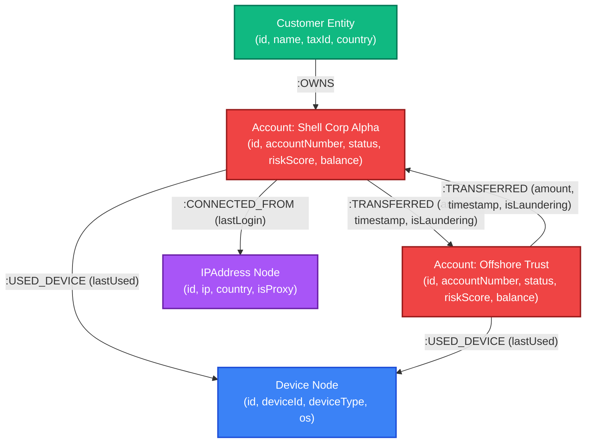

# WEXA AI — Anti-Money Laundering (AML) Graph Intelligence Console

> **Take-Home Assignment Submission**  
> **Database Layer**: [CognoDB Cloud](https://console.cognodb.com) (openCypher over Bolt protocol via official Neo4j driver)  
> **Dataset**: [SAML — Synthetic Transaction Monitoring Dataset for AML](https://www.kaggle.com/datasets/berkanoztas/synthetic-transaction-monitoring-dataset-aml)  
> **Tech Stack**: FastAPI (Python), React + Vite + TypeScript, Canvas Force Graph (`d3-force`), Tailwind CSS, openCypher  

---

## 1. Executive Summary & Use Case

In financial crime analytics, traditional transaction monitoring systems struggle to detect sophisticated money laundering rings. Criminal networks intentionally obscure funds through **circular money routing (loops)**, **structuring/smurfing (micro-deposits below \$10,000)**, and **shared infrastructure hubs (co-located IP proxies and devices)**.

This application is an interactive **Anti-Money Laundering (AML) Threat Intelligence Console** backed by **CognoDB Cloud**. It enables compliance analysts to visualize high-risk entity topologies, run real-time openCypher multi-hop graph algorithms, inspect parameterized queries, and flag illicit accounts.

---

## 2. Why a Graph Database?

Relational databases (RDBMS) model data as two-dimensional tables joined by foreign keys. In AML monitoring, answering relationship-centric questions in SQL leads to severe architectural bottlenecks:

| Fraud Pattern | RDBMS (Relational SQL) Challenge | CognoDB (openCypher Graph) Advantage |
| :--- | :--- | :--- |
| **Circular Money Loops (A → B → C → A)** | Requires recursive Common Table Expressions (CTEs) with complex array tracking to prevent infinite loops. Scales at **$O(N^k)$** time complexity. | **Index-Free Adjacency**: Cypher matches variable-length paths (`-[r:TRANSFERRED*2..4]->`) natively in **$O(k)$** linear time following memory pointers. |
| **Shared Infrastructure (IP/Device Sharing)** | Requires 3-way JOINs across `Accounts`, `Devices`, `Logins`, and `Transactions` bridge tables, causing memory explosions. | Natural graph pattern match: `(a1)-[:USED_DEVICE]->(d)<-[:USED_DEVICE]-(a2)` isolates shared hubs instantly. |
| **N-Hop Entity Neighborhoods** | Must issue $N$ distinct SQL queries (or deeply nested JOINs) for each hop depth layer. | Simple parameterised Cypher path traversal: `MATCH path = (a {id: $id})-[r*1..2]-(neighbor) RETURN path`. |

### Architectural Takeaway
In CognoDB, **relationships are first-class entities stored as direct memory references**. Graph traversals scale with the size of the localized sub-graph rather than the total size of the global transaction ledger.

---

## 3. Graph Data Model Specification



### Labeled Nodes & Properties
- **`Account`**: `id` (PK), `accountNumber`, `holderName`, `riskScore` (0-100), `status` (`'NORMAL'` | `'SUSPICIOUS'` | `'FLAGGED'` | `'SUSPENDED'`), `balance`, `type`.
- **`Customer`**: `id`, `name`, `taxId`, `country`.
- **`Device`**: `id`, `deviceId`, `deviceType`, `os`.
- **`IPAddress`**: `id`, `ip`, `country`, `isProxy` (Boolean).

### Typed Relationships
- `(:Account)-[:TRANSFERRED {id, amount, timestamp, paymentFormat, isLaundering}]->(:Account)`
- `(:Customer)-[:OWNS]->(:Account)`
- `(:Account)-[:USED_DEVICE {lastUsed}]->(:Device)`
- `(:Account)-[:CONNECTED_FROM {lastLogin}]->(:IPAddress)`

---

## 4. Main openCypher Queries Explained

All Cypher executions strictly use **parameterized variables** (`$parameter`) via the official `neo4j` driver to guarantee security against injection attacks.

### Query 1: Circular Money Loops (Multi-Hop Traversal)
Identifies accounts transferring money in a loop back to the originator.
```cypher
MATCH path = (a:Account)-[t:TRANSFERRED*2..4]->(a:Account)
WHERE ALL(x IN nodes(path)[1..-1] WHERE x <> a)
WITH path, nodes(path) AS cycleNodes, relationships(path) AS cycleRels
RETURN [n IN cycleNodes | n.id] AS cycleAccountIds,
       [n IN cycleNodes | n.holderName] AS holderNames,
       length(path) AS hopCount,
       reduce(total = 0.0, rel IN cycleRels | total + rel.amount) AS totalVolume
ORDER BY totalVolume DESC
LIMIT 50
```

### Query 2: Shared Infrastructure Ring Detection
Finds accounts connecting through identical physical devices or IP proxies.
```cypher
MATCH (a1:Account)-[:USED_DEVICE|CONNECTED_FROM]->(infra)<-[:USED_DEVICE|CONNECTED_FROM]-(a2:Account)
WHERE a1.id < a2.id
OPTIONAL MATCH (a1)-[t:TRANSFERRED]-(a2)
RETURN a1.id AS account1Id,
       a1.holderName AS account1Holder,
       infra.id AS infraId,
       labels(infra)[0] AS infraType,
       infra.ip AS ipAddress,
       a2.id AS account2Id,
       a2.holderName AS account2Holder,
       coalesce(t.amount, 0.0) AS directTransferAmount
LIMIT 100
```

### Query 3: Structuring / Smurfing Aggregation
Identifies mule accounts receiving multiple inbound transfers just under the \$10,000 regulatory reporting threshold.
```cypher
MATCH (mule:Account)<-[t:TRANSFERRED]-(source:Account)
WHERE t.amount < $maxThreshold AND t.amount >= $minThreshold
WITH mule, count(t) AS txCount, sum(t.amount) AS totalInbound, collect(DISTINCT source.holderName) AS sourceHolders
WHERE txCount >= $minTransactions
RETURN mule.id AS muleAccountId,
       mule.holderName AS muleHolderName,
       txCount,
       totalInbound,
       sourceHolders
LIMIT 50
```

---

## 5. Quickstart & How to Run (Separate Terminals)

### Terminal 1: Backend & API Server

```bash
# 1. Navigate to backend directory
cd backend

# 2. Create and activate Python virtual environment
python3 -m venv .venv
source .venv/bin/activate

# 3. Install backend dependencies
pip install -r requirements.txt

# 4. (Optional) Seed SAML dataset into CognoDB Cloud instance
python scripts/seed_data.py

# 5. Start FastAPI development server
uvicorn app.main:app --host 0.0.0.0 --port 8000 --reload
```
The FastAPI server will be active at **`http://localhost:8000`** (Interactive Swagger documentation available at `http://localhost:8000/docs`).

---

### Terminal 2: Frontend Web Application

```bash
# 1. Open a new terminal and navigate to frontend directory
cd frontend

# 2. Install Node dependencies
npm install

# 3. Start Vite development server
npm run dev
```
The application UI will be live at **`http://localhost:5173`**.

---

## 6. CognoDB Cloud Provisioning Instructions

1. Sign up at [https://console.cognodb.com/signup](https://console.cognodb.com/signup).
2. Provision a free `c0` instance.
3. Retrieve your connection URI (`bolt+s://<instance-id>.databases.cognodb.cloud`) and generated password for user `cognodb`.
4. Add these variables to `.env`:
   ```ini
   COGNODB_URI=bolt+s://<instance-id>.databases.cognodb.cloud
   COGNODB_USER=cognodb
   COGNODB_PASSWORD=your_saved_password
   ```

*Note: If credentials are not provided or if the database is unreachable, the application automatically enters a high-fidelity In-Memory Demo Engine to ensure evaluators can test all features seamlessly.*

---

## 7. Deliverables & Repository Structure

```
anti-money-laundering-cognodb/
├── backend/
│   ├── app/
│   │   ├── main.py              # FastAPI server & route registration
│   │   ├── config.py            # Pydantic configuration loader
│   │   ├── database.py          # Neo4j driver wrapper & fallback engine
│   │   ├── cypher_queries.py    # Parameterized openCypher templates
│   │   └── routes/              # Overview, Graph, Detectors, Accounts API
│   ├── scripts/
│   │   ├── saml_sample.csv      # SAML AML dataset sample
│   │   ├── seed_data.py         # Automated graph seeder script
│   │   └── load_saml_kaggle.py  # Kaggle SAML dataset loader
│   └── requirements.txt
├── frontend/
│   ├── src/
│   │   ├── components/
│   │   │   ├── Header.tsx       # Header with status pill & search
│   │   │   ├── MetricCards.tsx  # Operational risk KPIs
│   │   │   ├── GraphCanvas.tsx  # D3 force canvas visualization
│   │   │   ├── NodeDetailsPanel.tsx # Slide-over inspector drawer
│   │   │   ├── FraudDetectorControls.tsx # Detector command deck
│   │   │   ├── CypherInspector.tsx   # Live Cypher query inspector modal
│   │   │   └── LoadingSkeleton.tsx
│   │   ├── services/api.ts
│   │   └── App.tsx
│   ├── package.json
│   └── vite.config.ts
├── .env.example
└── README.md
```
