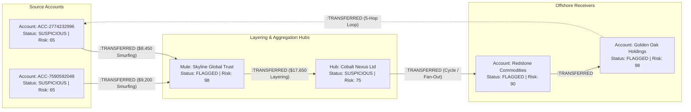

# WEXA AML — Anti-Money Laundering Graph Threat Intelligence & Agentic Copilot

[-blue?style=for-the-badge&logo=neo4j)](https://console.cognodb.com)
[](https://fastapi.tiangolo.com)
[](https://react.dev)
[](https://www.typescriptlang.org)
[](https://www.kaggle.com/datasets/berkanoztas/synthetic-transaction-monitoring-dataset-aml)

---

## 1. Executive Summary & Problem Overview

In modern financial crime analytics, legacy rule-based engines and relational SQL databases fail to detect coordinated money laundering networks. Criminal syndicates intentionally disguise illicit cash flows through:
* **Circular Layering Loops**: Funds route through 5-hop directed cycles ($A \to B \to C \to D \to E \to A$) to fabricate legitimate trade volume while transferring zero net economic value.
* **Structuring & Smurfing**: Large illicit sums are split into micro-transfers just below mandatory regulatory reporting thresholds ($10,000 Bank Secrecy Act CTR ceiling) and aggregated into mule accounts.
* **Multi-Branch Layering Hubs**: Intermediary bridge accounts funnel scatter-gather and fan-out transactions across high-risk offshore jurisdictions.

**WEXA AML** is an enterprise-grade **Graph Threat Intelligence & Autonomous Copilot Platform** backed by **CognoDB Cloud**. It ingests the authentic **Kaggle SAML Transaction Monitoring Dataset**, executing low-latency parameterized openCypher path queries, projecting interactive visual sub-graphs on a force-directed canvas, and utilizing an **Agentic AML Copilot** for automated FinCEN Suspicious Activity Report (SAR) synthesis.

---

## 2. Why Graph Database vs Relational SQL?

Relational databases (RDBMS) store entities in disjoint tables connected through foreign keys. In financial crime investigations, traversing multi-hop relationships requires recursive joins that suffer exponential performance degradation:

| Financial Crime Pattern | Relational SQL (RDBMS) Limitation | CognoDB openCypher Graph Advantage |
| :--- | :--- | :--- |
| **5-Hop Circular Money Loops** | Requires 5 recursive self-JOINs or Common Table Expressions (CTEs) with cycle-detection sets. Time complexity scales exponentially at $\mathcal{O}(N^5)$. | **Index-Free Adjacency**: Cypher traverses direct pointer chains natively in $\mathcal{O}(k)$ linear time without scanning table indexes. |
| **Smurfing Mule Aggregation** | `GROUP BY` aggregations can count deposits, but cannot trace the onward dispersal paths without recursive multi-stage subqueries. | Single expressive path query matches feeder accounts, aggregators, and target recipients in one traversal pass. |
| **Multi-Branch Layering Hubs** | Multi-hop bridge queries require joining separate transaction, account, and jurisdiction tables, consuming massive memory. | Matches bidirectional patterns `(hub)<-[t1]-(src)` and `(hub)-[t2]->(tgt)` in sub-millisecond lookups. |
| **1-2 Hop Ego-Neighborhoods** | Requires separate queries per depth layer, unioning multiple disparate foreign key tables. | Parameterized hop matching: `MATCH (a:Account {id: $id})-[r*1..2]-(m) RETURN a, r, m`. |

```
Relational Approach:     [Table Accounts] ──JOIN── [Table Transactions] ──JOIN── [Table Accounts] ... (O(N^k) Table Scans)
Graph Approach (CognoDB): Node(Account) ───────Direct Pointer ([:TRANSFERRED])───────> Node(Account) ... (O(k) Direct Traversal)
```

---

## 3. Graph Data Architecture & Dataset

The graph model is populated directly from the **Kaggle SAML Dataset (`SAML-D.csv`)** containing **16,110 Account Nodes** and **14,873 Transfer Relationships** across all 17 financial crime typologies.



### Graph Schema Elements:
* **Node Labels**:
  * `:Account`: Primary financial entity (`id`, `accountNumber`, `holderName`, `riskScore`, `status`, `balance`, `type`, `bank`).
* **Relationship Types**:
  * `:TRANSFERRED`: Directed wire transfer (`id`, `amount`, `paymentFormat`, `paymentCurrency`, `timestamp`, `isLaundering`, `launderingType`).

---

## 4. Core openCypher Detection Queries

All database executions strictly use parameterized queries (`$parameter`) to prevent injection and maximize execution plan caching.

### 1. Circular Money Loops (5-Hop Directed Layering)
```cypher
MATCH (a:Account)-[t1:TRANSFERRED]->(b:Account)-[t2:TRANSFERRED]->(c:Account)-[t3:TRANSFERRED]->(d:Account)-[t4:TRANSFERRED]->(e:Account)-[t5:TRANSFERRED]->(a)
WHERE a.id < b.id AND a.id < c.id AND a.id < d.id AND a.id < e.id
RETURN [a.id, b.id, c.id, d.id, e.id, a.id] AS nodeIds,
       [a.holderName, b.holderName, c.holderName, d.holderName, e.holderName, a.holderName] AS holderNames,
       [a.status, b.status, c.status, d.status, e.status, a.status] AS nodeStatuses,
       5 AS hopCount,
       (t1.amount + t2.amount + t3.amount + t4.amount + t5.amount) AS totalVolume,
       [
         {id: t1.id, amount: t1.amount, timestamp: t1.timestamp, launderingType: t1.launderingType},
         {id: t2.id, amount: t2.amount, timestamp: t2.timestamp, launderingType: t2.launderingType},
         {id: t3.id, amount: t3.amount, timestamp: t3.timestamp, launderingType: t3.launderingType},
         {id: t4.id, amount: t4.amount, timestamp: t4.timestamp, launderingType: t4.launderingType},
         {id: t5.id, amount: t5.amount, timestamp: t5.timestamp, launderingType: t5.launderingType}
       ] AS transactions
ORDER BY totalVolume DESC
LIMIT 50
```

### 2. Structuring & Smurfing Mule Rings
```cypher
MATCH (mule:Account)<-[t:TRANSFERRED]-(source:Account)
WHERE t.launderingType IN ['Smurfing', 'Structuring', 'Deposit-Send', 'Fan_In']
   OR (t.amount < $maxThreshold AND t.amount >= $minThreshold)
WITH mule, count(t) AS txCount, sum(t.amount) AS totalInbound, collect(DISTINCT source.holderName) AS sourceHolders
WHERE txCount >= $minTransactions
RETURN mule.id AS muleAccountId,
       mule.holderName AS muleHolderName,
       mule.status AS muleStatus,
       txCount,
       totalInbound,
       sourceHolders
ORDER BY totalInbound DESC
LIMIT 50
```

### 3. Multi-Branch Intermediary Layering Hubs
```cypher
MATCH (hub:Account)<-[t1:TRANSFERRED]-(a1:Account)
MATCH (hub)-[t2:TRANSFERRED]->(a2:Account)
WHERE a1.id <> a2.id AND (t1.isLaundering = true OR t2.isLaundering = true OR hub.riskScore >= 60)
RETURN a1.id AS account1Id,
       a1.holderName AS account1Holder,
       a1.status AS account1Status,
       hub.id AS infraId,
       'LaunderingHub' AS infraType,
       hub.bank AS ipAddress,
       a2.id AS account2Id,
       a2.holderName AS account2Holder,
       a2.status AS account2Status,
       coalesce(t1.amount, 0.0) + coalesce(t2.amount, 0.0) AS directTransferAmount
LIMIT 50
```

---

## 5. Key Platform Modules & Capabilities

```
┌────────────────────────────────────────────────────────────────────────────────────────┐
│                                WEXA AML PLATFORM                                       │
├────────────────────────────────┬───────────────────────────────────────────────────────┤
│  1. Interactive Graph Canvas   │  D3 force physics, animated particle edges, zoom/pan  │
│  2. Active Fraud Detectors     │  1-click loop/smurfing/hub topology canvas projection │
│  3. Account Inspector Drawer   │  5-factor risk score progress bars, status management │
│  4. openCypher Query Console   │  Live code editor, presets, scrollable results table  │
│  5. Agentic AML HelperBot      │  Reasoning traces, tool calling, action suggestions   │
│  6. FinCEN SAR Generator       │  Regulatory narrative synthesis (BSA / 31 CFR § 1020) │
│  7. NL to openCypher           │  Natural language question to graph query compiler   │
└────────────────────────────────┴───────────────────────────────────────────────────────┘
```

### 🧠 Agentic AML HelperBot
* **Transparent Reasoning Traces**: Collapsible `Agent Reasoning & Tool Calls` accordion displaying internal thought process, tool calls (`cognoDB_cypher_executor`), and latency benchmarks.
* **Auto-Rendered Scrollable Tables**: Embeds two-dimensional scrollable results tables with sticky headers and currency formatting directly in chat answers.
* **Contextual Action Chips**: One-click follow-up actions (`📄 Draft SAR Dossier`, `🔍 Trace Counterparties`, `🌐 Find Multi-Branch Hubs`).

### 📄 FinCEN SAR Generator
* Generates regulatory-compliant **Suspicious Activity Report (SAR)** filings citing **31 U.S.C. 5318(g)** (Bank Secrecy Act), **31 CFR § 1020.320**, and **FATF Recommendation 16**.
* One-click download as `.txt` dossier or copy to clipboard.

---

## 6. Quickstart & Installation Guide

### Prerequisites
* **Python**: 3.10+
* **Node.js**: 18.0+
* **CognoDB Cloud Instance** (or local Bolt-compatible graph database)

---

### Step 1: Clone Repository & Configure Environment

```bash
git clone https://github.com/Roninraj/anti-money-laundering-cognodb.git
cd anti-money-laundering-cognodb
```

Create a `.env` file in the root directory:

```ini
# CognoDB Cloud Connection Credentials
COGNODB_URI=bolt+s://db-cc6dfd18.databases.cognodb.com
COGNODB_USER=cognodb
COGNODB_PASSWORD=your_cognodb_password

# Optional: LLM API Keys (Falls back to high-fidelity Domain Engine if omitted)
GEMINI_API_KEY=your_gemini_api_key
OPENAI_API_KEY=your_openai_api_key
```

---

### Step 2: Start Backend Server

```bash
cd backend

# Create virtual environment
python3 -m venv .venv
source .venv/bin/activate

# Install dependencies
pip install -r requirements.txt

# (Optional) Re-seed pure Kaggle SAML dataset
python scripts/load_saml_kaggle.py

# Start FastAPI server
uvicorn app.main:app --host 0.0.0.0 --port 8000 --reload
```
* Backend API live at: `http://localhost:8000`
* Interactive OpenAPI / Swagger Docs at: `http://localhost:8000/docs`

---

### Step 3: Start Frontend Application

```bash
# In a separate terminal:
cd frontend

# Install Node dependencies
npm install

# Start Vite dev server
npm run dev
```
* Web Application live at: `http://localhost:5173`

---

## 7. REST API Documentation

| Method | Endpoint | Description | Sample Response / Payload |
| :--- | :--- | :--- | :--- |
| `GET` | `/api/overview/health` | CognoDB connection & cluster status | `{"status": "ONLINE", "mode": "CognoDB Bolt Live"}` |
| `GET` | `/api/overview/stats` | Aggregate graph counts & volume | `{"totalAccounts": 16110, "flaggedAccounts": 2682, ...}` |
| `GET` | `/api/overview/search?q={term}` | Indexed account prefix/substring search | `{"results": [...], "count": 10}` |
| `POST` | `/api/overview/recalculate-risk` | Triggers multi-factor risk recalculation | `{"message": "Risk scores updated"}` |
| `GET` | `/api/graph/full` | Default graph topology (nodes & links) | `{"graph": {"nodes": [...], "links": [...]}}` |
| `GET` | `/api/graph/neighborhood/{id}` | 1-2 hop ego-network for target account | `{"graph": {"nodes": [...], "links": [...]}}` |
| `POST` | `/api/graph/execute-cypher` | Live openCypher query executor | `{"results": [...], "columns": [...], "count": 10}` |
| `POST` | `/api/detectors/money-loops` | 5-hop circular laundering loop detector | `{"loops": [...], "graph": {...}, "detectedCount": 3}` |
| `POST` | `/api/detectors/shared-infra` | Multi-branch layering hub detector | `{"sharedRings": [...], "graph": {...}, "detectedCount": 50}` |
| `POST` | `/api/detectors/smurfing` | Structuring & smurfing mule detector | `{"smurfingRings": [...], "graph": {...}, "detectedCount": 50}` |
| `GET` | `/api/accounts/{id}` | Account demographics & risk factors | `{"account": {...}, "riskFactors": {...}}` |
| `PATCH` | `/api/accounts/{id}/status` | Update account status (`FLAGGED`, etc.) | `{"status": "FLAGGED"}` |
| `POST` | `/api/copilot/chat` | Autonomous Agentic Copilot Chat | `{"reply": "...", "steps": [...], "queryResults": {...}}` |
| `POST` | `/api/copilot/sar` | FinCEN Regulatory SAR narrative generator | `{"sarNarrative": "...", "riskScore": 90}` |
| `POST` | `/api/copilot/nl2cypher` | Natural Language to openCypher compiler | `{"cypher": "MATCH ...", "explanation": "..."}` |

---

## 8. Directory & File Structure

```
anti-money-laundering-cognodb/
├── backend/
│   ├── app/
│   │   ├── main.py                  # FastAPI app & CORS configuration
│   │   ├── config.py                # Environment & settings loader
│   │   ├── database.py              # CognoDB Bolt driver & in-memory fallback
│   │   ├── cypher_queries.py        # Parameterized openCypher templates
│   │   ├── routes/
│   │   │   ├── overview.py          # Dashboard stats, search, health routes
│   │   │   ├── graph.py             # Full graph, neighborhood & Cypher execution
│   │   │   ├── detectors.py         # Loop, smurfing & hub detector routes
│   │   │   ├── accounts.py          # Account detail inspection & status updates
│   │   │   └── copilot.py           # Agent chat, SAR generation & NL2Cypher
│   │   └── services/
│   │       └── llm_service.py       # Autonomous agent engine, tool runner & SAR generator
│   ├── scripts/
│   │   ├── load_saml_kaggle.py      # Kaggle dataset parser & UNWIND batch loader
│   │   └── seed_data.py             # Database initialization script
│   └── requirements.txt             # Python dependencies
├── frontend/
│   ├── src/
│   │   ├── components/
│   │   │   ├── Header.tsx           # Global header with search, status, and modal controls
│   │   │   ├── MetricCards.tsx      # Dashboard KPI metric cards
│   │   │   ├── FraudDetectorControls.tsx # Active detector execution deck
│   │   │   ├── GraphCanvas.tsx      # Interactive D3 force-directed canvas
│   │   │   ├── AccountInspector.tsx # Slide-over account details & risk breakdown drawer
│   │   │   ├── CypherInspector.tsx  # Interactive openCypher Query Console
│   │   │   └── AMLHelperBotModal.tsx# Autonomous Agentic Copilot & SAR Generator
│   │   ├── services/
│   │   │   └── api.ts               # Frontend API client library
│   │   ├── types/
│   │   │   └── aml.ts               # TypeScript data models & agent interfaces
│   │   ├── App.tsx                  # Core state orchestrator & layout
│   │   ├── index.css                # Tailwind CSS v4 & custom design tokens
│   │   └── main.tsx                 # React entry point
│   ├── package.json                 # Node dependencies
│   └── vite.config.ts               # Vite proxy & build configuration
├── .env.example                     # Environment template
└── README.md                        # Master documentation
```

---

## 9. Security & Governance Compliance

* **Parameterization**: Strict use of Cypher parameters prevents second-order Cypher injections.
* **Destructive Operation Guards**: Drop database and schema modification statements are rejected by safety middleware.
* **Regulatory Compliance Standards**: SAR narrative templates and threat models adhere to FinCEN Guidance FIN-2019-G001, FATF Recommendation 16, and the USA PATRIOT Act (Title III).

---

## 10. License & Attribution

* **Dataset Attribution**: [SAML — Synthetic Transaction Monitoring Dataset for AML](https://www.kaggle.com/datasets/berkanoztas/synthetic-transaction-monitoring-dataset-aml) by Berkan Oztas.
* **Database Platform**: [CognoDB](https://cognodb.com).
